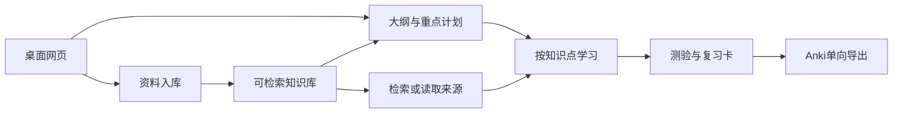

# StudyPilot：从能力、状态到代码

2026-09-09，按当前代码与真实运行结果整理的讨论稿。它解释现状，不是新的功能清单或重构授权。主代码基线a69fa94，桌面公式渲染e7c389d。原设计文档仍含历史阶段描述，阅读本稿时以实际入口和下面列出的差异为准。

## 1. 先记住两条链路

第一条链路负责把文件变成可定位的知识；第二条负责用这些知识组织学习。AgentScope负责模型与工具循环，Spring业务服务负责什么步骤允许发生、结果何时算成功、失败怎么恢复。

## 2. 最上层能力接口

这里的“接口”首先是输入、输出和责任边界，不意味着为了抽象而给每个只有一个实现的Service再加Java interface。

| 能力 | 输入→输出 | 当前入口与拥有者 |
|---|---|---|
| 管理资料库 | 名称→资料库ID；查询→文档状态 | `/api/knowledge-bases`；KnowledgeBaseService |
| 上传文件 | 文件分片、会话ID→持久文件/文档ID | `/api/files/multipart/*`；NativeMultipartUploadService |
| 处理文档 | documentId→可检索状态或具体失败 | DocumentPipeline；MQ消费者与恢复任务触发 |
| 查询知识 | 问题＋服务端资料范围→正文、来源ID、位置 | `POST /api/knowledge-bases/{id}/search`；KnowledgeRetrievalService |
| 打开来源 | chunkId＋服务端资料范围→原文 | `GET /api/knowledge-bases/{id}/source`；SourceReader |
| 创建学习计划 | 目标、课件/习题ID、知识点数→大纲、重点、任务 | `POST /api/learning/plans`、`/{id}/execute`；LearningPlanningService |
| 开始/恢复学习 | 成功planId→sessionId；sessionId→进度与历史 | `POST /api/learning/plans/{id}/session`；`GET /api/learning/sessions/{id}`及`/messages` |
| 执行一轮学习 | sessionId、requestId、当前消息→回答/产物/状态 | `POST .../messages`或`.../messages/stream`；LearningConversationService |
| 导出复习卡 | cardId→Anki笔记ID/持久失败记录 | `/api/review/cards/{id}/anki`；AnkiExportService |

检索用户范围不是模型可自由填写的参数；工具运行时从当前会话注入。当前身份仍是开发用途的服务端用户上下文，并没有完整注册、登录和RBAC产品。

## 3. 不同状态解决不同问题

**文档状态**：`STORED → PARSING → PARSED → CHUNKING → CHUNKED → EMBEDDING → EMBEDDED → INDEXING → INDEXED`。媒体用`TRANSCRIBING → TRANSCRIBED`替代文本解析步骤。失败记录FAILED及具体阶段，恢复复用已保存产物。上传完成不等于可以检索。

**计划阶段**：逐批`EXTRACT → OUTLINE → EMPHASIS → EMPHASIS_REVIEW → TASKS`；没有习题时无需重点映射/审查。每个阶段有自己的尝试、结果和错误，上游结果可复用。大纲并不通过一次TopK检索生成，而是遍历选中课件；习题只能给已有知识点增加重点依据。

**知识点状态**：`NEW → EXPLAINING → QUIZZING → CARD_GENERATING → COMPLETED`。

- NEW完成讲解后进入EXPLAINING；不是看到一段文字就自动推进。
- 提交五道完整题后进入QUIZZING；学生提交完整五题答案并评分后进入CARD_GENERATING。
- 三卡保存并完成当前点后，下一点才成为活跃点。追问通常不推进状态。
- `KnowledgePointLifecycle`校验相邻转换；一次最多推进一步，一个会话只有一个活跃点。

**回合状态**：RUNNING / SUCCEEDED / FAILED，另有执行阶段`MODEL → ARTIFACTS_COMMITTED → COMPLETED`。模型和工具产生结果后先提交测验/卡片/状态，再完成上下文保存。若摘要失败，恢复原回合的后半段，不重新生成已提交测验。requestId负责重复请求识别，租约和执行令牌控制谁有权提交。

知识点状态回答“学到哪”；回合状态回答“这句话处理完没”；阶段回答“失败后从哪续”。三者不应合成一个大状态机。

## 4. 组件各自做什么

| 组件 | 责任与关键实现 | 当前验证程度 |
|---|---|---|
| ingest/upload + storage | S3原生分片；MySQL保存uploadId/ETag，Redis Bitmap记录分片；SHA-256及唯一约束去重 | 20次400MB对照、断点/重启/并发完成等已跑；本机范围 |
| DocumentPipeline + Persistence | 解析或ASR、切块、向量化、索引；阶段产物、租约、逐项索引确认 | PDF/PPTX/TXT/MD及音视频均有真实链路，索引失败/重启恢复有记录 |
| algo/chunk | 结构边界打包、超长内容按token切分，parent/child关联 | 六组小实验已完成；800/0、parent2400/0为实验选中值，常规默认仍800/80 |
| rag/retrieval | BM25、向量、RRF、父块去重、4096正文预算；SourceReader按ID读取 | 真实批量检索已测；融合/回填不保证优于向量/子块 |
| LearningPlanningService | 完整资料遍历→大纲→习题重点→有序知识点；校验覆盖、引用和任务ID | 编译原理重点及算法/OS五点计划已真实验收；不是普遍语义准确率证明 |
| LearningConversationGateway | AgentScope ReAct循环，读取资料、理解当前消息、提出动作 | 真实五点闭环已跑；模型仍可能误解事实或格式 |
| LearningTurnIntent + ArtifactValidator + TurnPersistence | 约束状态、五题/三卡结构、实际引用；事务提交业务产物与回合 | 幂等、状态、结构检查已测；不负责证明每个知识解释正确 |
| LearningConversationCompactor | 完成点摘要＋阈值压缩；缓存摘要结果、保存AgentState | 功能与进程恢复已测；正式18会话对照未完成，无节省比例 |
| ObservedModel + LearningTraceService | 调用数、usage、模型输入输出、工具与状态关联 | 真实调用账本/trace已有；未知usage明确保留 |
| review/AnkiExportService | 稳定标识查重、单向创建/复用Anki笔记、失败可重试 | 三张持久卡真实导入和GUI查看已验收；无复习成绩回流 |

## 5. Agent究竟能做什么

模型可调用：`knowledge_search(query)`、`knowledge_read(chunkId)`、`learning_explanation_done`、`learning_quiz_publish`、`learning_quiz_submit`、`learning_cards_publish`。

`knowledge_read`只读当前知识点计划已经确认的来源，避免中文检索无法重新找到英文课件；仍检查用户和知识库归属，成功读取才进入本轮可引用集合。

工具并不直接拥有数据库任意写入权。它们形成受约束的意图与产物；应用校验来源、数量、当前状态，然后提交。普通问答可无动作。模型不是业务状态的权威，历史摘要也不能覆盖服务器状态。

规划是应用编排的多阶段模型调用，执行是一个AgentScope ReAct Agent。项目可称Plan-and-Execute学习流程，但没有多Agent规划团队，也没有独立通用工作流平台。

## 6. 信息存在哪里

- MySQL：知识库/文档、chunk与来源关系、学习计划、知识点、测验、卡片、回合、摘要、上下文、trace与处理状态。
- RustFS：原始文件、规范文本及可复用的中间产物。大文件不用塞进会话上下文。
- Elasticsearch：BM25与向量检索，以及parent/child对应内容。
- Redis：上传分片进度等临时加速数据；丢失后从持久信息恢复，不作为唯一业务事实。
- RocketMQ：文档处理事件和重试投递；不是学习会话的总指挥。
- AgentScope AgentState：供模型继续对话的摘要/近期上下文。完整网页聊天历史另存，不从摘要反向还原。
- Anki：用户的复习卡消费端；当前没有把复习结果同步回来。

## 7. 真正需要掌握的设计与算法

1. **结构切块和父子检索**：小块定位、大块补上下文；预算造成覆盖与完整性的取舍。
2. **RRF**：按多路排名倒数相加，不直接比较BM25与向量的分数；当前两路等权、k=60。
3. **有限状态机＋事务提交**：模型只能建议允许的动作，服务器决定推进；失败不能伪装成功。
4. **幂等、租约、阶段产物复用**：解决重复请求/重复MQ投递、进程失联、昂贵阶段重做。
5. **上下文压缩**：THRESHOLD仅超阈值时处理；WHOLE_HISTORY在点完成后压全历史；LOCAL在点完成后仅替换当前点。三者都保留阈值保护。
6. **数据边界**：业务状态、完整历史、模型上下文分开；用户范围来自服务器，不来自模型。
7. **SSE与任务生命周期分离**：断开显示不取消后端任务，用原requestId查已保存结果。当前只有NEW讲解阶段推送正文增量，其它阶段缓冲以避免答案泄漏。

没有复杂考试时间优化算法：HIGH在基础时间上加10分钟，MEDIUM加5分钟。没有站内FSRS复习产品、知识图谱、长期画像或Anki双向同步；目录里存在相关旧算法类，不代表业务已经接通。

## 8. 目前应该讨论的收敛点

- 统一用户主入口：当前前端主流程已走资料驱动`/plans`，但`POST /sessions`仍调用旧的一次性目标规划，不保证课件覆盖。旧explain/quiz/cards快捷入口已转发同一个ConversationService，并不是另一套Agent循环。是否删除旧规划与未用快捷入口，应先确定保留的演示/API范围。
- 对齐文档和代码：旧技术方案写同步REST与并行两路检索；当前主页面用SSE，RetrievalService两路顺序调用。旧描述不能继续作为架构事实。
- 明确“功能实现”和“质量达标”：五点闭环可以跑通，引用可定位，但已抽查到讲解否定词错误；语义质量不是状态校验能保证的。
- 控制学习粒度：当前一个“知识点”可能包含10个子主题、估计120分钟，实际更像一章。五题/三卡是否覆盖得住，应先从产品含义讨论，不能只靠增加模型输出长度。
- 把正式实验从产品实现拆开：比较脚本和证据不是用户产品组件。恢复讨论时，先讲清以上边界，再选择一个需要修改的点。

建议讨论顺序：学习会话和知识点的含义 → 一句话如何产生一次合法状态变化 → 资料与来源接口 → 大纲/重点规划 → 压缩/恢复 → 异步上传与导出。暂不开始新一轮重构。
